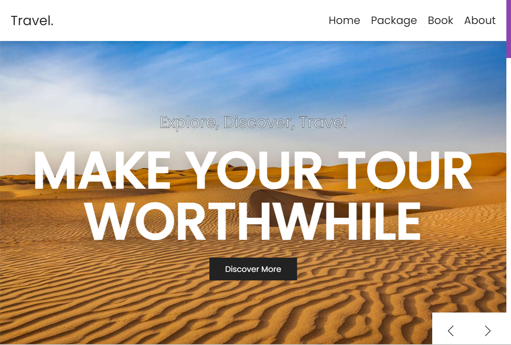
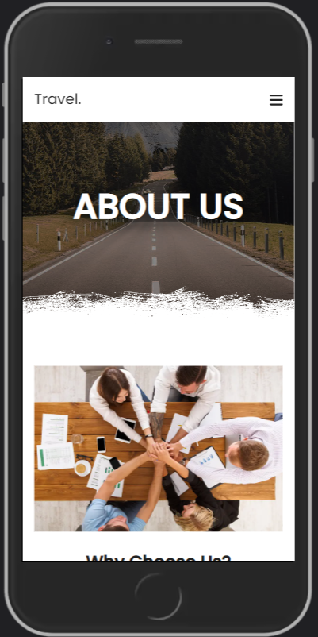
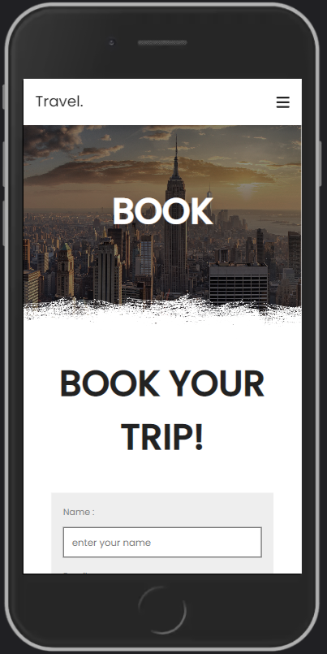
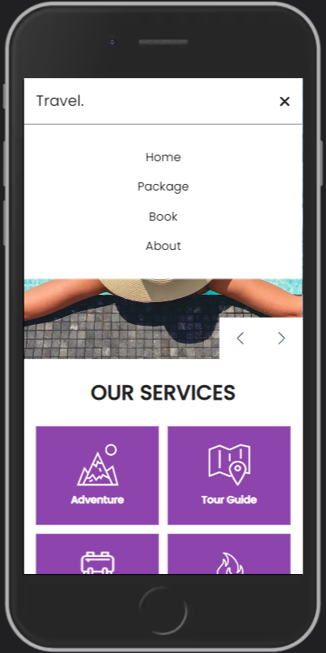

    <h1>Travel Agency</h1>

Travel Agency is a completely responsive marketing website, allowing customers to book trips and tours worldwide.

https://github.com/MoriaHamami/TravelAgency/assets/100145853/39d5b206-a7e5-4ffa-9d13-187b74022d91

___

### Table of Contents
- [Technologies](#technologies)
- [Showcase](#showcase)

## Technologies

A completely responsive travel agency website, created using React & Next.js frameworks, HTML, CSS vanilla and Javascript.  
The API calls to the backend are done using axios, while the data is fetched using PHP and SQL from a MySQL database.
Several third side libraries were used for different goals, such as axios, swiper, form-data and more.

The main features of this website are:

✅ Header with toggle menu effect using vanilla javascript.

✅ Home section with touch slider using swiper.js

✅ About section using flexbox.

✅ Reviews section with touch slider using swiper.js

✅ Packages section using grid.

✅ Booking form section.

✅ Footer section using grid.

## Showcase

### Homepage
The landing page, in which the user is introduced to the travel agency, includes a swiper with eye catching transformations.

### A mobile fit!
The use of **conditional rendering** enabled creating a responsive design. Just a taste of the mobile experience:

    
    
    

